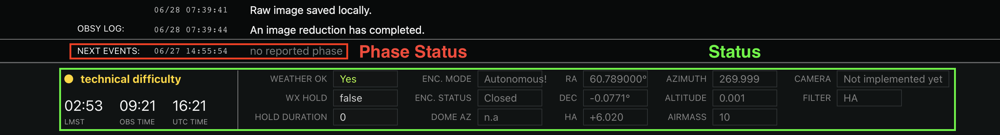
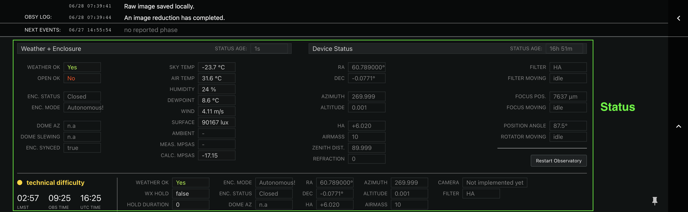

# Photon Ranch Status

This repository manages the status of observatories in the Photon Ranch network.
This includes infrastructure for storing the data as well as the API used to send and retrieve it.
The websockets used to update the frontend are used here but managed in a different repository, [datastreamer](https://github.com/LCOGT/datastreamer).

## Description

Observatories can send status updates to describe the devices (e.g. RA/dec pointing, filter,
alt/az pointing), the weather (e.g. sky temp, wind, weather okay to open), and the enclosure
(e.g. enclosure opened, manual mode). These statuses can be updated continually for a constant
understanding of observatory and device condition.

Observatories can also send a phase status update. Similar to the [user status](https://github.com/LCOGT/photonranch-userstatus),
this describes the processes occuring at an observatory but will be used for larger scale phases
of an observation instead of granular detail.





## Local Development

### Basic Requirements

You will need the [Serverless Framework](https://www.serverless.com/framework/docs/getting-started)
installed locally for development. For manual deployment to AWS as well as for updating dependencies,
you will need to install [Node](https://nodejs.org/en/),
[npm](https://docs.npmjs.com/downloading-and-installing-node-js-and-npm),
and [AWS CLI](https://docs.aws.amazon.com/cli/latest/userguide/getting-started-install.html),
configuring with your own AWS credentials.

Clone the repository to your local machine:

``` bash
$ git clone https://github.com/LCOGT/photonranch-status.git
$ cd photonranch-status
```

From the root of this project directory, install serverless environment dependencies with

``` bash
$ npm install
```

Create and activate a python virtual environment (using python 3.7 or later):

``` bash
$ python -m venv venv
$ source venv/bin/activate
$ pip install --upgrade pip
$ pip install -r requirements.txt
```

### Running Locally

Having completed the above tasks, we can now continue with the steps needed to run the API locally.

First, make sure you have serverless credentials configured. You can login with `$ serverless login` which will open
a browser window, or you can set the `SERVERLESS_ACCESS_KEY` environment variable with a serverless
access key.

In order to run dynamodb locally, you'll need to make sure java is installed in your system.
You can verify by running `$ java -version` which should return the version if one is installed.
Once java is installed, we can install the local dynamodb:

``` bash
$ serverless dynamodb install 
```

This creates the `.dynamodb/` folder in the main project directory, used whenever the project is run locally.
Note that this command only needs to be run if `.dynamodb/` doesn't already exist.

The last step before running is getting data to seed the local dynamodb tables. To do this, we need seed
data as specified in our `serverless.yml` file, under `custom.dynamodb.seed.domain.sources.rawsources`.
To intialize with empty data, create two empty json files:

``` bash
$ touch sample_data/statusTable.json
$ touch sample_data/phaseStatusTable.json
```

If you want the tables to contain realistic data, we can copy the contents of the production tables running in aws
the local tables by running the following python script.
You'll need credentials with dynamodb read permissions on your local machine for this to work.

``` bash
$ python sample_data/copy_dynamodb_data.py
```

This will automatically create the files with sample data used to seed the local tables. You can specify which tables
you want to be copied by adding the stage name to this script, e.g. `$ source copy_dynamodb_data.sh dev`
would copy data from the tables running in dev rather than prod.

Finally, we're ready to run the local API:

``` bash
$ serverless offline start --reloadHandler
```

The api should now be accessible at `http://localhost:3000/`.
The base url isn't a valid route, but you can try visiting `http://localhost:3000/dev/allopenstatus` to
to see it in action.

The `--reloadhandler` flag enables hot reloading so that any changes you save (not including changes to `serverless.yml`)
will be automatically applied without needing to stop and restart the local server.

Please note that not all functionality has been verified to work offline yet.

## Deployment

This project currently has two deployed stages, `prod` and `dev` and will automatically
deploy to the respective stage via github actions whenever changes are added to the `main` or `dev` branches.

## Status Syntax

There are three supported values for `statusType`: 'weather', 'enclosure', and 'device'. Since different observatories
may or may not have the same access to weather or enclosure status, they are handled separate from devices.

The basic format of a status payload is as follows:

```javascript
{
    "statusType": "device", // weather | enclosure | device
    "status": {
        "mount": { // type of device. camera, mount, filter_wheel, etc.
            "mount_1": {// name of specific mount instance. Usually there is just one of each device type.
                "ra": 12.345, // key/val pairs for status items.
                "dec": 67.89,
                ...
            } 
            ...
        },
        "camera": {
            "sbig_ccd_1": {
                "activity": "idle",
                "temp": -20.1, 
                ...
            }
        }
        ...
    }
}
```

## API Endpoints

All of the following endpoints use the base url `https://status.photonranch.org/status`.
An additional test endpoint is located at `https://status.photonranch.org/test`.

- POST `/{site}/status`
  - Description: Send a new status
  - Authorization required: No (will be added later)
  - Path Params:
    - "site": (str) site code that status is being sent from
  - Request body:
    - "statusType": (str), either "weather", "enclosure", or "device"
    - "status": JSON body as specified in syntax above
  - Responses:
    - 200: Successfully posted status
    - 400: Missing required key ("statusType" or "status")
  - Example request:

  ```python
  # python 3.6
  import requests, json
  url = "https://status.photonranch.org/status/tst/status"
  payload = json.dumps({
      "statusType": "weather",
      "status": {
          "observing_conditions": { # this is the type of device used for weather data
              "observing_conditions1": { # instance name of the weather device.  
                                          # Note: there may be more than one weather device.
                  "temperature": 15.3,
                  "wind_speed": 1.37,
              }
          }
      }
  })
  response = requests.request("POST", url, data=payload)
  print(response.json())
  ```

- GET `/{site}/complete_status`
  - Description: Retrieve complete status from specified site
  - Authorization required: No
  - Path Params:
    - "site": (str) site code that status is being retrieved from
  - Responses:
    - 200: Successful
    - 400: Site not provided in path param
  - Example request:

    ```javascript
    // javascript
    const axios = require('axios');
    url = "https://status.photonranch.org/status/tst/complete_status"
    let response = await Axios.get(url)
    let tst_status = response.data
    ```  

- GET `/{site}/clear_all_status`
  - Description: Removes all status entries from specified site
  - Authorization required: No
  - Path Params:
    - "site": (str) site code that status is being retrieved from
  - Responses:
    - 200: Successful removal of status entries
  - Example request:

  ```javascript
  // javascript
  const axios = require('axios');
  url = "https://status.photonranch.org/status/tst/clear_all_status"
  let response = await Axios.get(url)
  ```  

- GET `/{site}/{status_type}`
  - Description: Retrieve specified status type from specified site
  - Authorization required: No
  - Path Params:
    - "site": (str) site code that status is being retrieved from
    - "status_type": (str) type of either "weather", "enclosure", or "device"
  - Responses:
    - 200: Successful
  - Example request:  

  ```javascript
  // javascript
  const axios = require('axios');
  url = "https://status.photonranch.org/status/tst/enclosure"
  let response = await Axios.get(url)
  let tst_enclosure_status = response.data
  ```  

- GET `/allopenstatus`
  - Description: Retrieve true/false value describing if weather okay to open for all sites
  - Note: sites without a readable wx_ok status will simply omit that value from the response
  - Authorization required: No
  - Responses:
    - 200: Successful, returns a dictionary with sites and "wx_ok" key-value
  - Example request:

  ```javascript
  // javascript
  const axios = require('axios');
  url = "https://status.photonranch.org/status/allopenstatus"
  let response = await Axios.get(url)
  let ok_open_enclosures = response.data
  ```

- POST `/phase_status`
  - Description: Send a new phase status which appears in the site status footer below the user status
  - Authorization required: no (will be added later)
  - Request body:
    - "message": (str) text to be displayed as phase status
    - "site": (str) sitecode (eg. "sro")
  - Responses:
    - 200: Successfully posted phase status
    - 400: Missing arguments in the POST body
  - Example request:

  ```python
  # python 3.6
  import requests, json
  url = "https://status.photonranch.org/status/phase_status"
  payload = json.dumps({
      "site": "sro",
      "message": "example phase status message"
  })
  requests.request("POST", url, data=payload)
  ```
